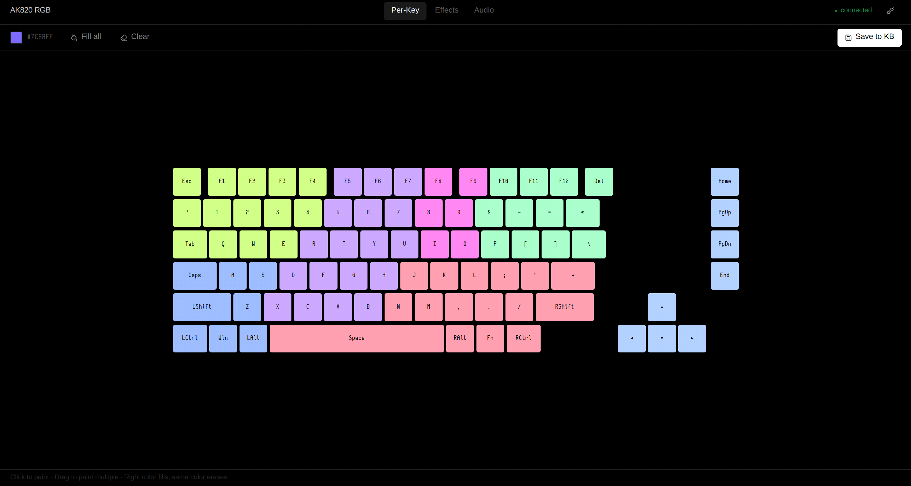
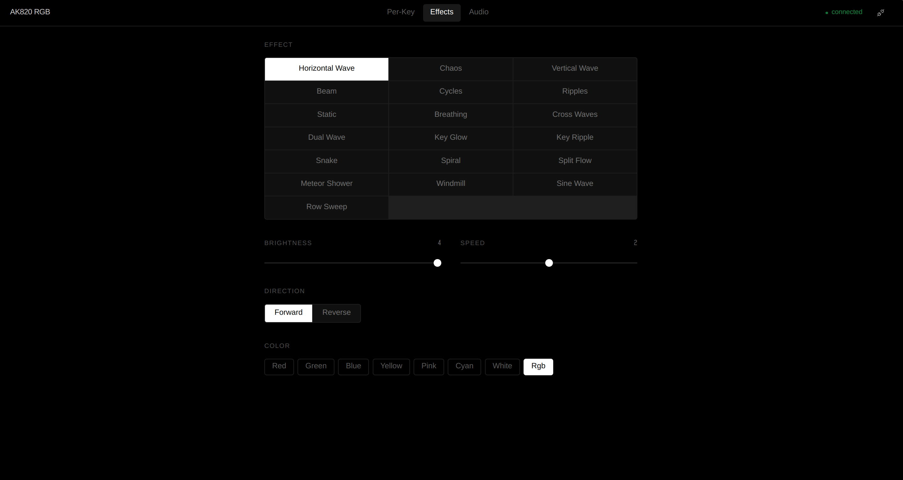
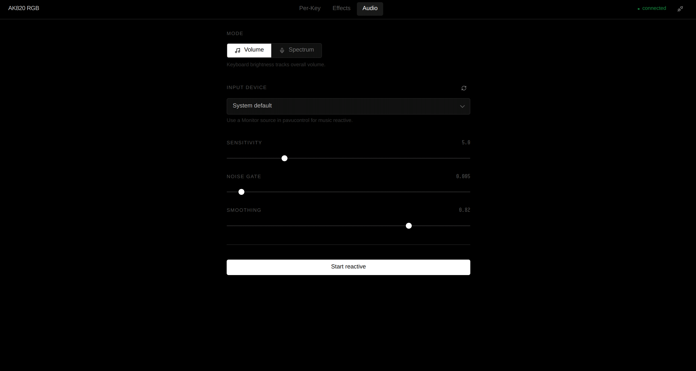

# Ajazz AK820 Max Plus — RGB Control

A Linux desktop app for the Ajazz AK820 Max Plus keyboard. The official software is Windows-only with no public protocol documentation — this project reverse-engineered the USB HID protocol and built a native desktop app around it.



---

## Features

- **Per-key RGB** — click or drag to paint individual keys, fill all, clear
- **Hardware effects** — 19 animation modes (Horizontal Wave, Breathing, Spiral, etc.) with brightness, speed, direction, and color controls
- **Audio reactive** — real-time FFT-driven lighting via microphone or audio monitor:
  - *Volume mode* — whole-keyboard brightness tracks overall volume
  - *Spectrum mode* — Bass / Mid / Treble frequency bands each drive a separate LED zone





---

## Stack

| Layer | Technology |
|---|---|
| Desktop wrapper | PyWebView (Qt backend via PyQt6) |
| Frontend | Svelte + Tailwind CSS + Lucide icons |
| System tray | pystray + Pillow |
| Audio capture | sounddevice + NumPy (FFT) |
| HID communication | Raw `/dev/hidraw*` via Python `os` module |

---

## Requirements

- Linux (tested on Wayland / Hyprland)
- Python 3.11+
- Node.js 18+
- PyQt6 installed system-wide (`python-pyqt6` package)

---

## Install

```bash
./install.sh
```

The script:
1. Creates a Python venv with `--system-site-packages` (needed to access system PyQt6)
2. Installs Python deps (`pywebview`, `pystray`, `numpy`, `sounddevice`, etc.)
3. Runs `npm install` and builds the Svelte frontend
4. Installs a udev rule so the keyboard is accessible without root (`/etc/udev/rules.d/99-ajazz-ak820.rules`)

Re-plug the keyboard after the first install.

---

## Run

```bash
./run.sh

# With WebKit inspector (right-click → Inspect Element)
./run.sh --debug
```

---

## Protocol

See [`PROTOCOL.md`](PROTOCOL.md) for a full specification of the reverse-engineered USB HID protocol — packet structure, opcodes, LED index map, hardware mode table, and audio reactive implementation details.

---

## Project Structure

```
app/
  keyboard.py     HID controller
  audio.py        FFT audio engine
  api.py          PyWebView JS bridge
  tray.py         System tray icon
main.py           Entry point
ui/
  src/
    App.svelte
    lib/
      KeyboardVisualizer.svelte
      ModesPanel.svelte
      AudioPanel.svelte
      store.js
test/             Original reverse-engineering scripts
PROTOCOL.md       USB HID protocol spec
```
